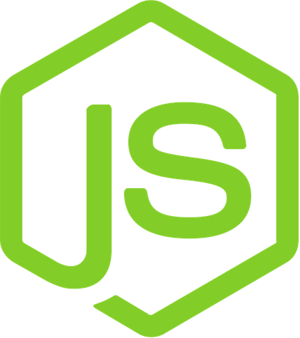
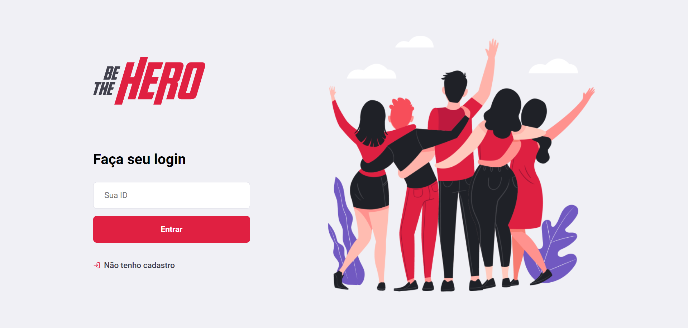
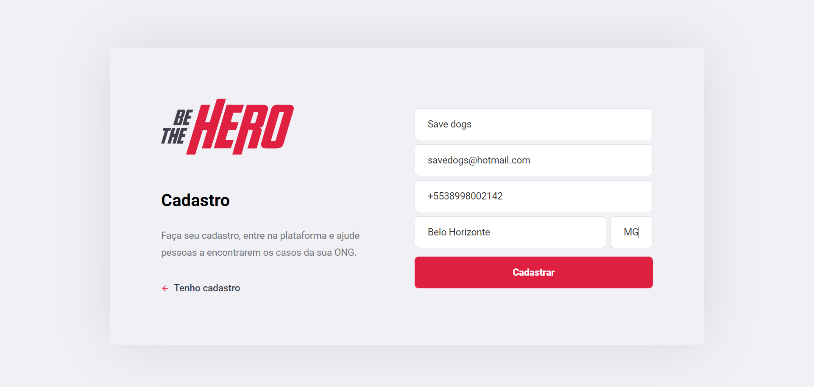
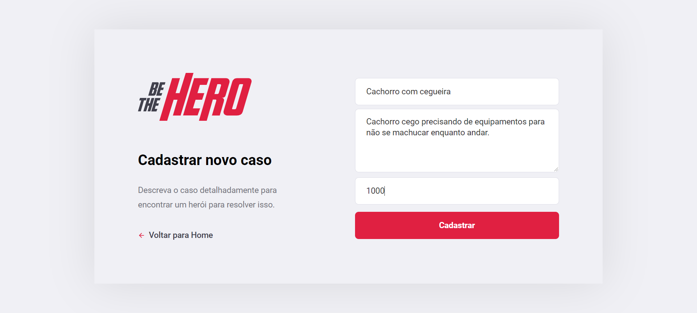
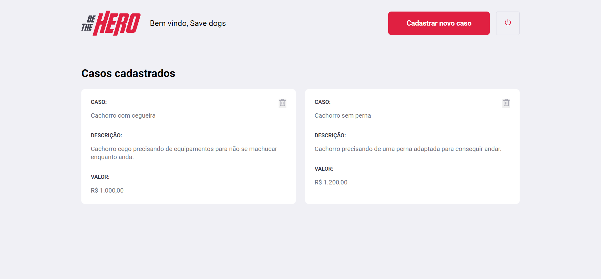
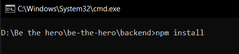
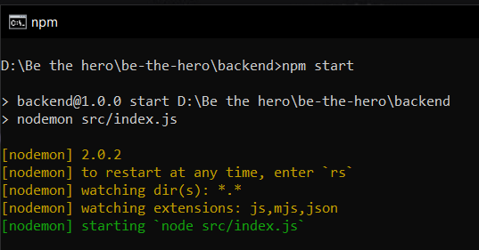
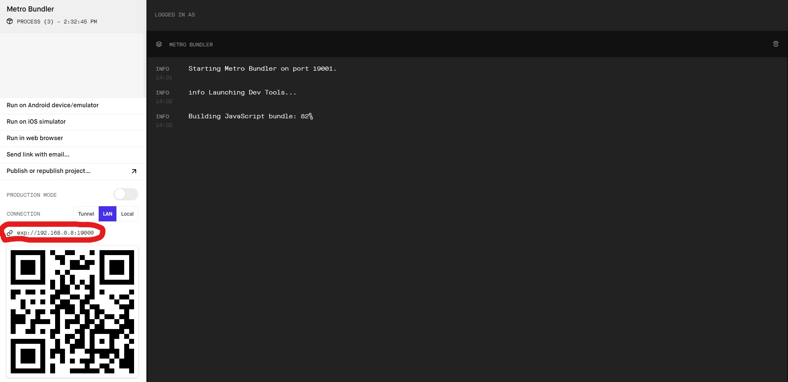

<h1 align="center">
    
</h1>

<h1 align="center">
    
</h1>

<h2 align="center"> Uma aplicação destinada a conectar pessoas a ONGs beneficentes. </h2>

<h3 align="center"> Frontend construído em  React, Mobile em  React Native, backend em  Node e banco de dados  SQLite </h3>

<p align="center">  </p>

---

Durante a Semana Omnistack 11.0, criamos do zero uma aplicação completa. destinada a conectar pessoas com desejo de ajudar a ONGs que precisam dessa ajuda.

## Telas aplicação web 

<p align="center">
	
	
	
	
</p>

<h2><strong>:satellite: Algumas das tecnologias utilizadas*</strong></h2>

<h3>Back-end (NodeJS)</h3>
<li>Express</li>
<li>KnexJS</li>

<h3>Banco de dados</h3>
<li>SQLite3</li>

<h3>Versão Web (ReactJS)</h3>
<li>Axios</li>
<li>React Icons</li>
<li>React Router Dom</li>

<h3>Versão Mobile (React-Native)</h3>
<li>Axios</li>
<li>Expo
  <ul>
    <li>Expo Location</li>
    <li>Expo Mail Composer</li>
  </ul>
</li>
<li>React Gesture Handler</li>
<li>React Navigation</li>
<li>React Native Screens</li>

<h6>* Para verificar as outras tecnologias, acesse o package.json</h6>

### Instalando aplicação

Execute o comando  na raiz das pastas (backend, frontend e mobile) para instalar as dependências.

Após executado o código acima, execute o comando  na raiz de cada projeto.

> Obs: Baixe o aplicativo EXPO no seu celular pela APPLE STORE ou PLAY STORE.
> Obs: Quando executar o comando npm start no projeto mobile, será aberto uma tela no seu navegador, anote o numero circulado na imagem abaixo que corresponde ao seu computador.

<h1 align="center">
    
</h1>

Com o número anotado, entre no arquivo api.js dentro de services. Altere o código de acordo com o que apareceu no seu expo, mantendo a porta ```:3333``` sem alteração. Somente altere o código antes da porta e reinicie o comando ```npm start```.

Com o aplicativo da EXPO no seu celular, escaneie o QR CODE que abriu no navegador. Lembrando que o celular precisa estar na mesma rede de WIFI que o notebook/PC que esta abrindo a aplicação.

## Aplicação mobile

<p align="center">
	
</p>

 
Dúvidas entre em contato pelo <h4 align="center"> <a href="https://www.linkedin.com/in/marco-antonio-monteiro-de-brito-541ba0144/" target="_blank">Linkedin</a> </h4>

<h4 align="center"> <em>&lt;/&gt;</em> by <a href="https://github.com/marcomonteirobrito" target="_blank">marcomonteirobrito</a> </h4>